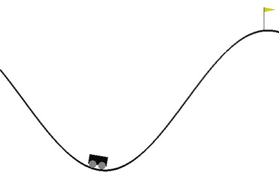

# QReinforcementLearning_MountainCarProblem

## Using QLearning on the OpenAI's MountainCar-v0 environment

With this project, I trained an AI Agent with Reinforcement Learning (QLearning) on the OpenAI's [MountainCar-v0](https://gym.openai.com/envs/MountainCar-v0/) environment.
The goal is to drive up the mountain on the right; however, the car's engine is not strong enough to scale the mountain in a single pass. Therefore, the only way to succeed is to drive back and forth to build up momentum.

A program that **solves Statics Truss Problems, made with a mix of C# (used for GUI) and Python (used to solve the problems and graphing the result: Scipy and Matplotlib)**. With this program, you will be able to **save the problem solution graph and the nodes, connections and forces** in a very high resolution.

Program view (solved problem)|  Full size view (solved problem)
:---------------------------:|:--------------------------------:
           |  

## Prerequisites
* Python 3.5
* Matplotlib
* Numpy
* Gym

## Getting started

## What I learned

* Markov Processes and Bellman Equation
* QLearn Algorithm 
* QLearn Algorithm optimization with Greedy, ε-Greedy and ε-Greedy-Descendant variations
* To use Gym by OpenAI
* Multidimensional arrays with Numpy

## Authors

* **Gianfranco Lacasella** - *Initial work* - [glacasellaUANDES](https://github.com/glacasellaUANDES)

## License

This project is licensed under the GNU GENERAL PUBLIC LICENSE- see the [LICENSE.md](LICENSE.md) file for details
