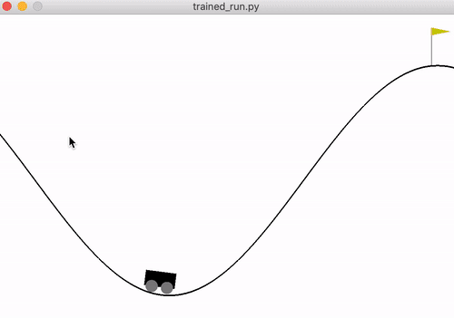
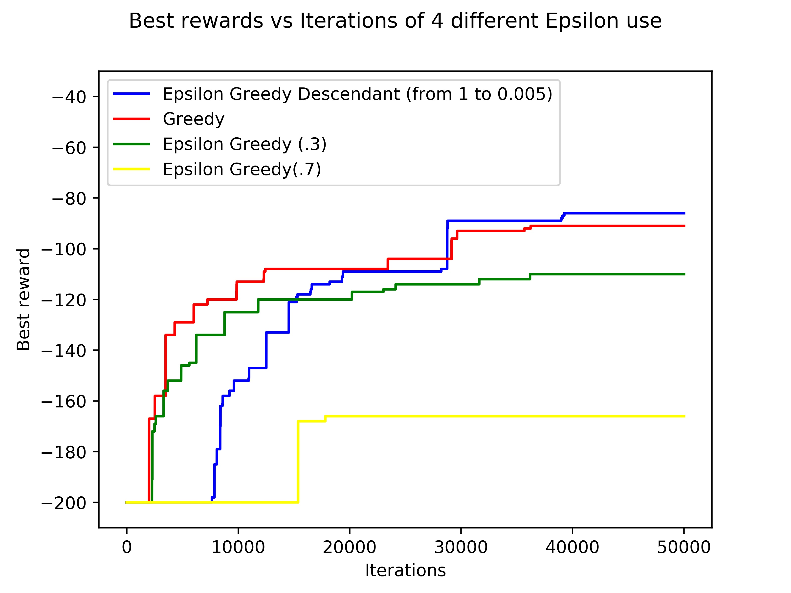
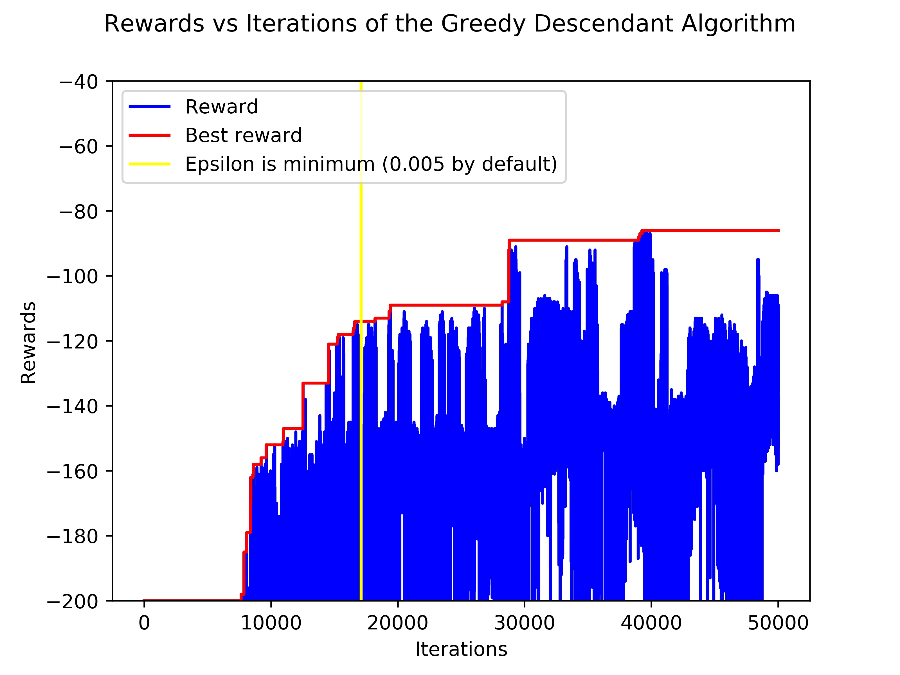

# QReinforcementLearning_MountainCarProblem

## Using QLearning on the OpenAI's MountainCar-v0 environment

On this project, I trained an AI Agent with **Model-free Reinforcement Learning (QLearning)** on the OpenAI's [MountainCar-v0](https://gym.openai.com/envs/MountainCar-v0/) environment.
  The main goal is to drive up the mountain on the right; however, **the car's engine is not strong enough to scale the mountain in a single pass**. Therefore, the only way to succeed is to drive back and forth to build up momentum.

  

In order to make the Agent succeed, I used Markov Processes and the Bellman Equation to make the state-action pairs quality update:

  

## My results

The environment gives a living reward of -1 on each step the Agent makes, and has a maximum of 200 steps per episode. Thats why,
at the training beginning the Best Rewards are -200. I tried to compare Greedy, ε-Greedy and ε-Greedy-Descendant algorithms.

The parameters used to make the comparison are:
* 50000 episodes
* Learning rate 0.05
* Discount factor 0.95
* On the Greedy, obviously ε=0
* On the ε-Greedy I used two values of ε: 0.3 and 0.7
* On the ε-Greedy-Descendant:
	1. Starting ε: 1
	2. Minimum ε: 0.005
	3. Discount factor (for each step): 3ε/10000000

Algorithms comparation         |  The best one (ε-Greedy-Descendant)
:-----------------------------:|:----------------------------------:
        |  

As can be seen in the previous images, the ε-Greedy-Descendant algorithm was the best as expected:

| Algorithm             | Best reward    |
| --------------------- |:--------------:|
| ε-Greedy (ε=0.7)      | -166           |
| ε-Greedy (ε=0.3)      | -110           |
| Greedy                | -91            |
| ε-Greedy-Descendant   | -86            |

## Prerequisites
* Python 3.5
* Matplotlib
* Numpy
* Gym

## Getting started

## What I learned

* Markov Processes and Bellman Equation
* QLearn Algorithm 
* QLearn Algorithm optimization with Greedy, ε-Greedy and ε-Greedy-Descendant variations
* To use Gym by OpenAI
* Multidimensional arrays with Numpy

## Authors

* **Gianfranco Lacasella** - *Initial work* - [glacasellaUANDES](https://github.com/glacasellaUANDES)

## License

This project is licensed under the GNU GENERAL PUBLIC LICENSE- see the [LICENSE.md](LICENSE.md) file for details
